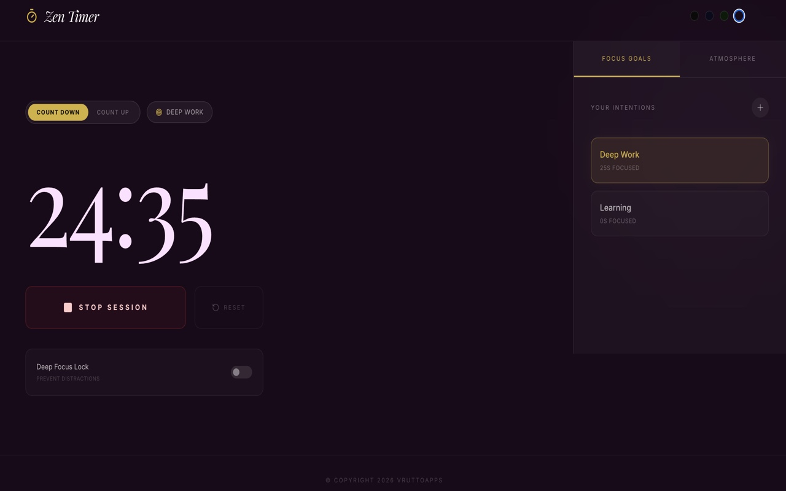
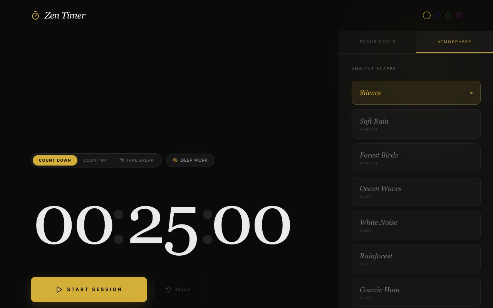
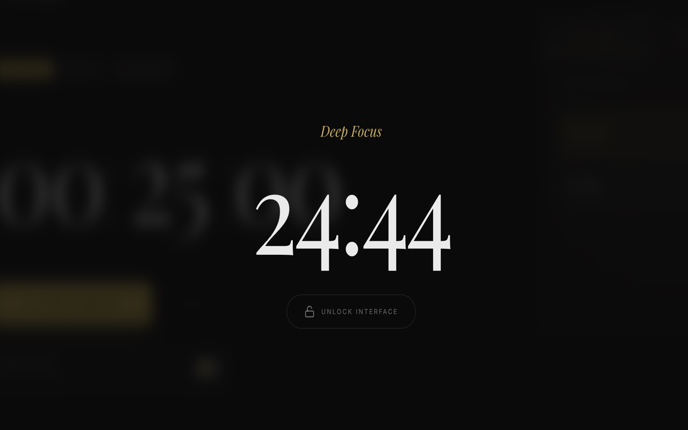
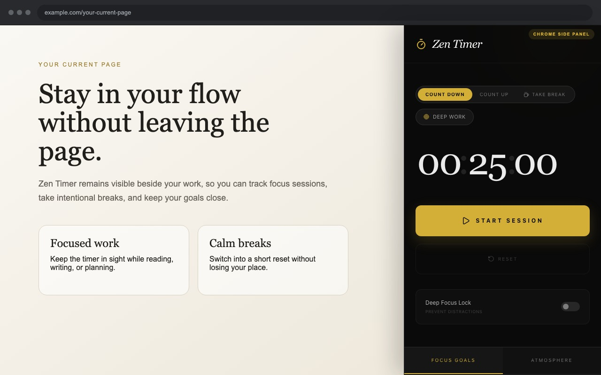
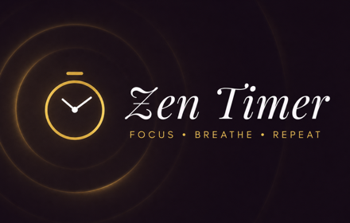

# Zen Timer Focus

-An ambient focus timer with goals, themes, relaxing sounds, and a deep focus lock.

Zen Timer provides a persistent focus timer through Chrome’s New Tab page and side panel, with countdown, count-up, break, goal, and ambient-sound features.

[zen-timer-focus.vercel.app/
](https://zen-timer-focus.vercel.app/)

## Chrome extension

[Get the Chrome extension from chrome webstore](https://chromewebstore.google.com/detail/ldghdeggjpjicoofpenephbhimggmkld?utm_source=item-share-cb)

### Local development

Build the extension files:

```sh
npm run build:extension
```

Then load the generated `dist` folder in Chrome:

1. Open `chrome://extensions`.
2. Enable Developer mode.
3. Click Load unpacked.
4. Select this project's `dist` folder.

The extension opens Zen Timer Focus as Chrome's New Tab page and as the toolbar popup. A background service worker keeps timer state in Chrome storage, so active sessions continue after the popup closes.

## Gallery

<table>
  <tr>
    <td width="50%" align="center">
      
      <br />
      <sub><b>Timer and focus goals</b></sub>
    </td>
    <td width="50%" align="center">
      
      <br />
      <sub><b>Atmosphere controls</b></sub>
    </td>
  </tr>
  <tr>
    <td width="50%" align="center">
      
      <br />
      <sub><b>Deep focus mode</b></sub>
    </td>
    <td width="50%" align="center">
      
      <br />
      <sub><b>Chrome extension panel</b></sub>
    </td>
  </tr>
  <tr>
    <td width="50%" align="center">
      
      <br />
      <sub><b>Chrome Web Store marquee</b></sub>
    </td>
    <td width="50%" align="center">
      
      <br />
      <sub><b>Chrome Web Store promotion</b></sub>
    </td>
  </tr>
  <tr>
    <td colspan="2" align="center">
      
      <br />
      <sub><b>Extension icon</b></sub>
    </td>
  </tr>
</table>
